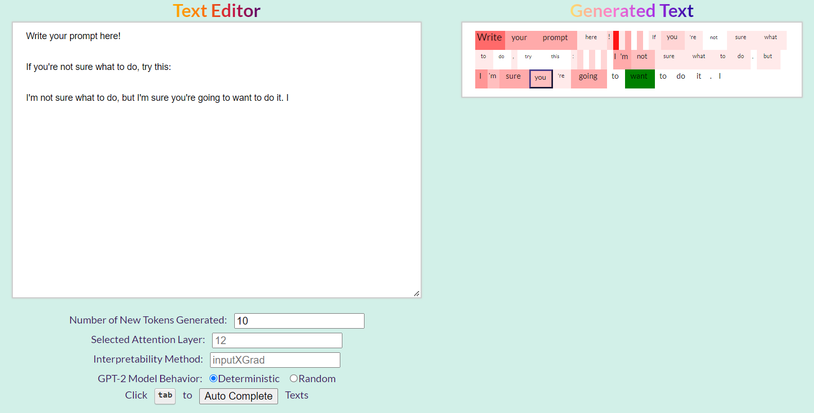

# LangVis
CS 279R Final Project

To install the dependencies, first run `pip install -e .` then run `pip install captum`, `pip install Flask` and `pip install Flask-SQLAlchemy`.

Alternatively, try `conda env create --name envname --file=new_environment.yml` file if you have anaconda installed.

Run `python app.py` to open the application.

Write your prompt on the left panel, and hit generate button.

Hover your mouse on a generated word in the right panel to visualize its saliency map (redder color means more significant words in term of gradient-based saliency). 

The hovered word is highlighted in green.

Click on a word to see the other token that the word pays the most attention to (highlighted by a blue border).
